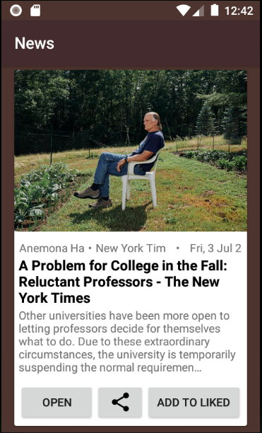
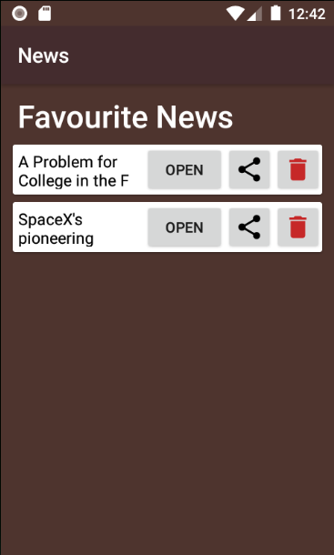

# Android News app API Java
made by Nick Shpilevsky  

A coursework. This app is made using Java and API [News API](https://newsapi.org/).  
There is a list of popular news, you can open every news and read full article on the original site, share it with friend or add to favourites.  

# Demo

